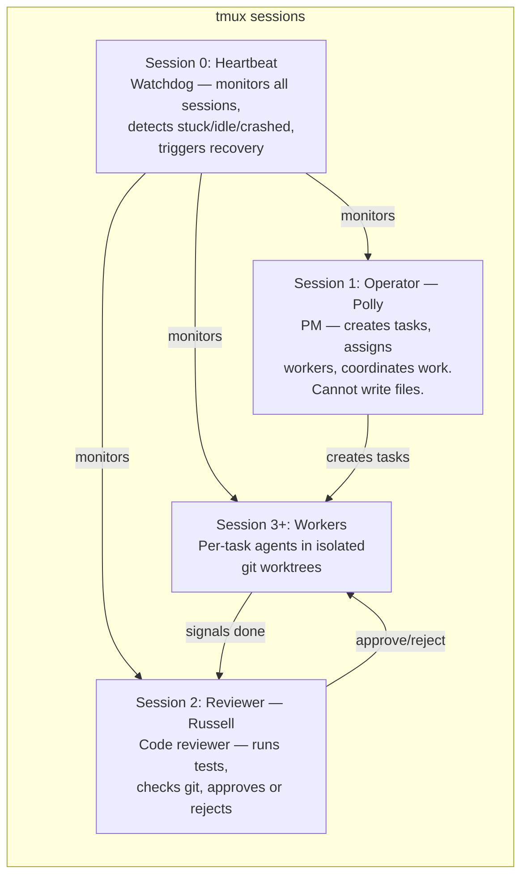
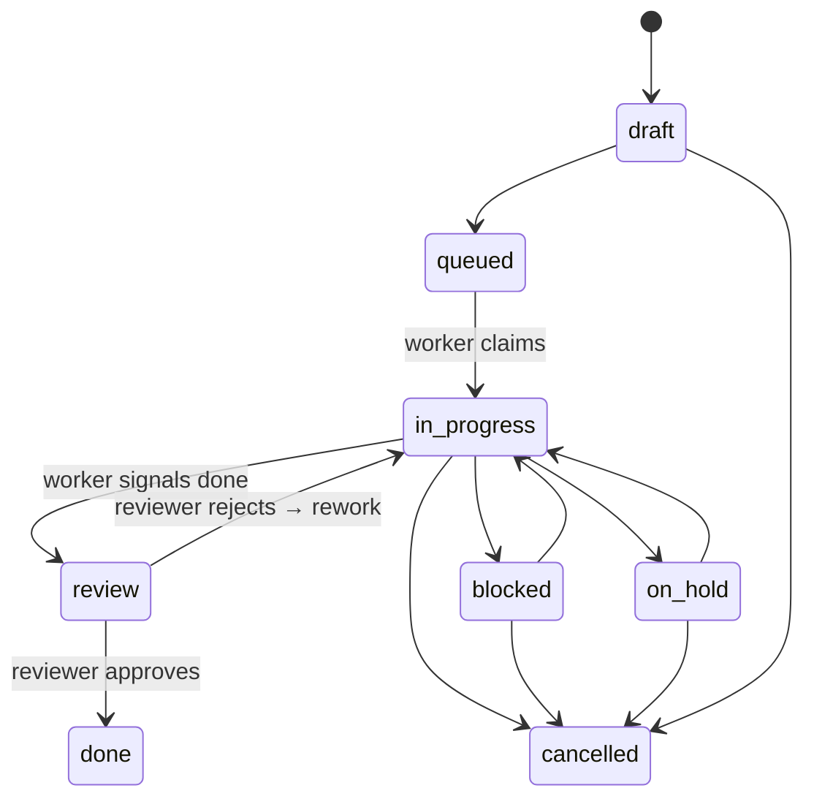

# PollyPM

PollyPM is a tmux-first control plane for people who want multiple AI coding sessions working in parallel without losing visibility or control. It is built for operators managing Claude Code and Codex CLI across real projects, with a live cockpit, heartbeat supervision, and issue-driven worker coordination. At a high level, PollyPM launches and monitors dedicated operator and worker sessions, routes work through a shared task pipeline, and keeps state recoverable through logs, checkpoints, and project-aware context. The result is managed multi-session AI coordination through native terminal sessions rather than opaque background agents.

**New here? Start with [docs/getting-started.md](docs/getting-started.md)** — a 15-minute walkthrough from install to your first completed task. The rest of this README is the module map and architecture reference for contributors.

## Architecture

```mermaid
graph TB
    subgraph User["User Layer"]
        CLI["pm CLI<br/><i>typer</i>"]
        Cockpit["Cockpit TUI<br/><i>textual</i>"]
    end

    subgraph Core["Core — Required"]
        Supervisor["Supervisor<br/>Session lifecycle · health ·<br/>recovery · failover"]
        WorkService["Work Service<br/>Task state machine ·<br/>flow engine · gates"]
        StateStore["StateStore<br/>SQLite + WAL"]
        Inbox["Inbox v2<br/>Threaded messages"]
        Config["Config<br/>TOML resolution"]
        TmuxClient["Tmux Client<br/>Session · window · pane mgmt"]
    end

    subgraph PluginHost["Plugin Host"]
        API["Plugin API v1<br/><i>PollyPMPlugin protocol</i>"]
    end

    subgraph Providers["Provider Plugins — replaceable"]
        Claude["☑ claude<br/>Claude Code adapter"]
        Codex["codex<br/>Codex CLI adapter"]
    end

    subgraph Runtimes["Runtime Plugins — replaceable"]
        LocalRT["☑ local_runtime<br/>Direct shell exec"]
        DockerRT["docker_runtime<br/>Docker container"]
    end

    subgraph Heartbeats["Heartbeat Plugins — replaceable"]
        LocalHB["☑ local_heartbeat<br/>tmux pane monitoring"]
    end

    subgraph Schedulers["Scheduler Plugins — replaceable"]
        InlineSched["☑ inline_scheduler<br/>In-process polling"]
    end

    subgraph Profiles["Agent Profile Plugins — replaceable"]
        CoreProfiles["☑ core_agent_profiles<br/>polly · russell · heartbeat ·<br/>worker · triage"]
        ItsAlive["itsalive<br/>Deploy-aware prompts<br/>+ session hooks"]
        Magic["magic<br/>Compatibility alias"]
    end

    subgraph Backends["Storage Backends — replaceable"]
        FileTask["file task backend<br/>Markdown issues"]
        GitHubTask["github task backend<br/>GitHub Issues sync"]
        FileMemory["file memory backend<br/>Append-only entries"]
    end

    CLI --> Supervisor
    CLI --> WorkService
    Cockpit --> Supervisor
    Cockpit --> WorkService

    Supervisor --> TmuxClient
    Supervisor --> StateStore
    Supervisor --> Inbox
    Supervisor --> Config

    WorkService --> StateStore

    Supervisor --> API
    API --> Claude
    API --> Codex
    API --> LocalRT
    API --> DockerRT
    API --> LocalHB
    API --> InlineSched
    API --> CoreProfiles
    API --> ItsAlive
    API --> Magic

    WorkService --> FileTask
    WorkService --> GitHubTask
    WorkService --> FileMemory
```



> ☑ = default plugin, loaded unless overridden in config.

## Module Map

Every major subsystem has a defined role, a fixed file path, and is independently replaceable (or on the path to it). Status legend:

- **solid** — stable and in production
- **needs tests** — functional but under-tested
- **partial** — scaffolded; known bugs or missing features
- **refactor** — exists but needs decomposition
- **planned** — issue filed, not yet built

### Core Rail

| Module | What it does | Path | Status |
| --- | --- | --- | --- |
| Supervisor | Session lifecycle, health, recovery, account failover | `src/pollypm/supervisor.py` | refactor |
| Config | TOML resolution (global + project + plugin overrides) | `src/pollypm/config.py` | solid |
| StateStore | SQLite (WAL) connection, schema, migrations | `src/pollypm/storage/state.py` | solid |
| Plugin Host | Plugin discovery, validation, registration | `src/pollypm/plugin_host.py` | solid |
| Plugin API v1 | Versioned Protocol surface for plugins | `src/pollypm/plugin_api/v1.py` | solid |
| Service API | Supervisor facade (currently leaky) | `src/pollypm/service_api.py` | refactor |
| Runtime Env | Per-session env-var resolution | `src/pollypm/runtime_env.py` | solid |
| State Epoch | Monotonic version counter for change detection | `src/pollypm/state_epoch.py` | solid |
| Atomic I/O | Crash-safe file writes | `src/pollypm/atomic_io.py` | solid |
| Worktrees | Git worktree helpers with session lock | `src/pollypm/worktrees.py` | solid |
| Accounts | Multi-account / failover management | `src/pollypm/accounts.py` | solid |
| Projects | Project registration and resolution | `src/pollypm/projects.py` | solid |

### Work Service (task management)

| Module | What it does | Path | Status |
| --- | --- | --- | --- |
| Service Protocol | Work service API contract | `src/pollypm/work/service.py` | solid |
| SQLite Backend | Production work service implementation | `src/pollypm/work/sqlite_service.py` | partial |
| Mock Backend | In-memory impl for tests | `src/pollypm/work/mock_service.py` | solid |
| Flow Engine | YAML flow parsing, node evaluation | `src/pollypm/work/flow_engine.py` | solid |
| Gate Engine | Pluggable preconditions on transitions | `src/pollypm/work/gates.py` | solid |
| Schema | SQLite DDL + migrations | `src/pollypm/work/schema.py` | solid |
| Models | Task / FlowNode / Execution dataclasses | `src/pollypm/work/models.py` | solid |
| Migrate | Legacy-data ingestion | `src/pollypm/work/migrate.py` | solid |
| Dashboard projection | Task counts / roll-up for cockpit | `src/pollypm/work/dashboard.py` | solid |
| Session Manager | Per-task worker lifecycle (provision/teardown) | `src/pollypm/work/session_manager.py` | partial |
| Work CLI | `pm task …` surface | `src/pollypm/work/cli.py` | partial |

### Session Layer

| Module | What it does | Path | Status |
| --- | --- | --- | --- |
| SessionService Protocol | Pluggable session lifecycle | `src/pollypm/session_services/base.py` | solid |
| Tmux SessionService | Default tmux-based implementation | `src/pollypm/session_services/tmux.py` | solid |
| Tmux SessionService plugin | Built-in plugin wrapper | `src/pollypm/plugins_builtin/tmux_session_service/` | solid |
| Tmux Client | Low-level `tmux` command wrapper | `src/pollypm/tmux/client.py` | solid |
| Workers | Worker lifecycle helpers | `src/pollypm/workers.py` | needs tests |
| Recovery Prompt | Resume-from-crash prompt assembly | `src/pollypm/recovery_prompt.py` | solid |
| Session Intelligence | Persona resolution, context packing | `src/pollypm/session_intelligence.py` | solid |
| Checkpoints | Resumable-state snapshots | `src/pollypm/checkpoints.py` | needs tests |

### Heartbeat &amp; Jobs

| Module | What it does | Path | Status |
| --- | --- | --- | --- |
| Heartbeat Backend | Mechanical session-health sweep (invoked by `core_recurring`'s `session.health_sweep` handler) | `src/pollypm/heartbeats/` | stable |
| Scheduler Plugins | Cadence dispatcher | `src/pollypm/schedulers/` | refactor |
| itsalive integration | Deploy-aware self-check | `src/pollypm/itsalive.py` | refactor |
| Job Runner | Current placeholder job runner | `src/pollypm/job_runner.py` | partial |
| Heartbeat Tick (sealed) | Roster-driven minimal tick | `src/pollypm/heartbeat/` | planned |
| Job Queue | SQLite-backed durable jobs | `src/pollypm/jobs/queue.py` | planned |
| Job Worker Pool | Long-running consumers | `src/pollypm/jobs/workers.py` | planned |
| Roster API | Plugin-registered cron entries | `src/pollypm/plugin_api/roster.py` | planned |
| Job Handler Registry | Plugin-registered job handlers | `src/pollypm/plugin_api/handlers.py` | planned |
| Jobs CLI | `pm jobs …` queue inspection | `src/pollypm/jobs/cli.py` | planned |

### Providers &amp; Runtimes

| Module | What it does | Path | Status |
| --- | --- | --- | --- |
| Provider SDK | Shared provider interface | `src/pollypm/provider_sdk.py` | solid |
| Provider Protocol | Adapter contract | `src/pollypm/providers/base.py` | solid |
| Claude provider | Claude Code CLI adapter | `src/pollypm/providers/claude.py` | solid |
| Codex provider | Codex CLI adapter | `src/pollypm/providers/codex.py` | solid |
| Claude plugin | Built-in plugin wrapper | `src/pollypm/plugins_builtin/claude/` | solid |
| Codex plugin | Built-in plugin wrapper | `src/pollypm/plugins_builtin/codex/` | solid |
| Runtime Protocol | Pluggable execution env | `src/pollypm/runtimes/base.py` | solid |
| Local runtime | Direct shell execution | `src/pollypm/runtimes/local.py` | solid |
| Docker runtime | Container-wrapped execution | `src/pollypm/runtimes/docker.py` | partial |
| Runtime launcher | Routing across runtimes | `src/pollypm/runtime_launcher.py` | solid |
| LLM runner | Non-session agent invocation | `src/pollypm/llm_runner.py` | needs tests |

### Agent Profiles

| Module | What it does | Path | Status |
| --- | --- | --- | --- |
| AgentProfile Protocol | Persona registration contract | `src/pollypm/agent_profiles/base.py` | solid |
| Core profiles (shim) | Legacy in-tree profile list | `src/pollypm/agent_profiles/builtin.py` | refactor |
| Core profiles plugin | polly / russell / heartbeat / worker / triage | `src/pollypm/plugins_builtin/core_agent_profiles/` | solid |
| itsalive plugin | Deploy-aware prompts + hooks | `src/pollypm/plugins_builtin/itsalive/` | solid |
| magic plugin | Compatibility alias for itsalive | `src/pollypm/plugins_builtin/magic/` | solid |
| Project Intelligence | Project-level context packing | `src/pollypm/project_intelligence.py` | needs tests |

### Storage Backends (task / memory / docs)

| Module | What it does | Path | Status |
| --- | --- | --- | --- |
| Task Backend Protocol | Replaceable task storage | `src/pollypm/task_backends/base.py` | solid |
| File task backend | `issues/` markdown storage | `src/pollypm/task_backends/file.py` | solid |
| GitHub task backend | GitHub Issues sync | `src/pollypm/task_backends/github.py` | solid |
| Memory Backend Protocol | Replaceable memory log | `src/pollypm/memory_backends/base.py` | solid |
| File memory backend | Append-only markdown | `src/pollypm/memory_backends/file.py` | refactor |
| Doc Backend Protocol | Replaceable docs index | `src/pollypm/doc_backends/base.py` | solid |
| Markdown doc backend | Repo-local markdown docs | `src/pollypm/doc_backends/markdown.py` | needs tests |
| Doc scaffold | Initial docs layout generator | `src/pollypm/doc_scaffold.py` | solid |

### Sync Adapters (work service)

| Module | What it does | Path | Status |
| --- | --- | --- | --- |
| Sync manager | Routing + retries across adapters | `src/pollypm/work/sync.py` | partial |
| File sync adapter | `issues/` folder projection | `src/pollypm/work/sync_file.py` | solid |
| GitHub sync adapter | GitHub Issues projection | `src/pollypm/work/sync_github.py` | partial |
| Plugin registry | Sync-plugin registration | `src/pollypm/work/plugin_registry.py` | solid |

### Communication

| Module | What it does | Path | Status |
| --- | --- | --- | --- |
| Inbox v2 | Threaded messaging | `src/pollypm/inbox_v2.py` | solid |
| Inbox delivery | Routing + fanout | `src/pollypm/inbox_delivery.py` | solid |
| Inbox processor | Scheduled sweep (→ heartbeat roster post-v1) | `src/pollypm/inbox_processor.py` | refactor |
| Inbox escalation | Stuck-message escalation | `src/pollypm/inbox_escalation.py` | needs tests |
| Messaging | Low-level message helpers | `src/pollypm/messaging.py` | solid |
| Notifications | OS-level notifications | `src/pollypm/notifications.py` | needs tests |

### Observability

| Module | What it does | Path | Status |
| --- | --- | --- | --- |
| Transcript ingest | Claude/Codex JSONL parsing | `src/pollypm/transcript_ingest.py` | solid |
| Transcript ledger | Per-session token accounting | `src/pollypm/transcript_ledger.py` | solid |
| Knowledge extract | Post-session summary mining | `src/pollypm/knowledge_extract.py` | needs tests |
| Capacity | Rate / usage-limit tracking | `src/pollypm/capacity.py` | solid |
| History import | Backfill old transcripts | `src/pollypm/history_import.py` | partial |
| Commit validator | Worker commit checks | `src/pollypm/commit_validator.py` | needs tests |
| Rules | Validation / policy expressions | `src/pollypm/rules.py` | needs tests |

### User Interface

| Module | What it does | Path | Status |
| --- | --- | --- | --- |
| `pm` CLI | Unified command entry point | `src/pollypm/cli.py` | solid |
| Cockpit TUI | Live control cockpit | `src/pollypm/cockpit.py` | solid |
| Cockpit UI widgets | Textual widget tree | `src/pollypm/cockpit_ui.py` | solid |
| Cockpit rail | Project / session navigation rail | `src/pollypm/cockpit_rail.py` | partial |
| Dashboard data | Cockpit data provider | `src/pollypm/dashboard_data.py` | partial |
| Onboarding | First-run setup flow | `src/pollypm/onboarding.py` | solid |
| Onboarding TUI | Setup wizard | `src/pollypm/onboarding_tui.py` | solid |
| Account TUI | Account management flow | `src/pollypm/account_tui.py` | solid |
| Control TUI | Live control palette | `src/pollypm/control_tui.py` | needs tests |
| Config patches | TOML-patch helpers | `src/pollypm/config_patches.py` | solid |
| Version check | Upgrade-available nudge | `src/pollypm/version_check.py` | solid |

### Planned Subsystems

| Module | What it does | Path | Status |
| --- | --- | --- | --- |
| Completion detection | Auto-trigger review when worker signals done | `src/pollypm/work/completion.py` | planned |
| Triage sessions | Auto-created per-project triage agents | `src/pollypm/triage/` | planned |
| Cost tracking | Token usage per task (not just session) | `src/pollypm/cost.py` | planned |
| Live activity feed | Real-time cross-session view | `src/pollypm/activity_feed.py` | planned |
| Morning briefing | Delta-since-last-look report | `src/pollypm/briefing.py` | planned |
| Proactive rollover | Session rollover at 90% usage | `src/pollypm/rollover.py` | planned |

## Writing a Plugin

Plugins are Python packages with a `plugin.py` that exports a `PollyPMPlugin` instance:

```python
from pollypm.plugin_api.v1 import Capability, PollyPMPlugin
from my_provider import MyAdapter

plugin = PollyPMPlugin(
    name="my_provider",
    capabilities=(Capability(kind="provider", name="my_provider"),),
    providers={"my_provider": MyAdapter},
)
```

The plugin host discovers plugins from four sources (precedence low → high): built-in, Python entry_points under `pollypm.plugins`, user-global `~/.pollypm/plugins/`, and project-local `<project>/.pollypm/plugins/`. See [docs/plugin-discovery-spec.md](docs/plugin-discovery-spec.md) for the full specification, [docs/plugin-authoring.md](docs/plugin-authoring.md) for a from-scratch walkthrough, and [docs/plugin-boundaries.md](docs/plugin-boundaries.md) for boundary contracts between plugins.

## Session Roles



## Task Lifecycle



## Quick Start

```bash
# First run — walks you through account setup and launches everything
pm

# That's it. From here you talk to Polly.
pm send operator "Build a weather CLI with current conditions and 5-day forecast"
```

`pm` is the only command you need. On first run it handles onboarding, account login, and session launch. After that:

```bash
pm                  # Attach to the cockpit
pm ui               # Open the cockpit TUI
pm status           # System overview
pm send operator …  # Send work to Polly
pm down             # Shut everything down
```
