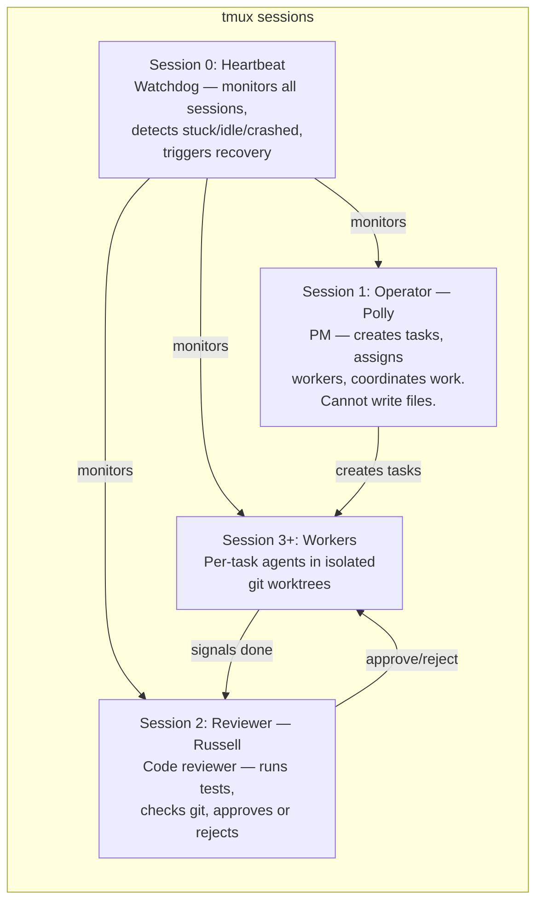
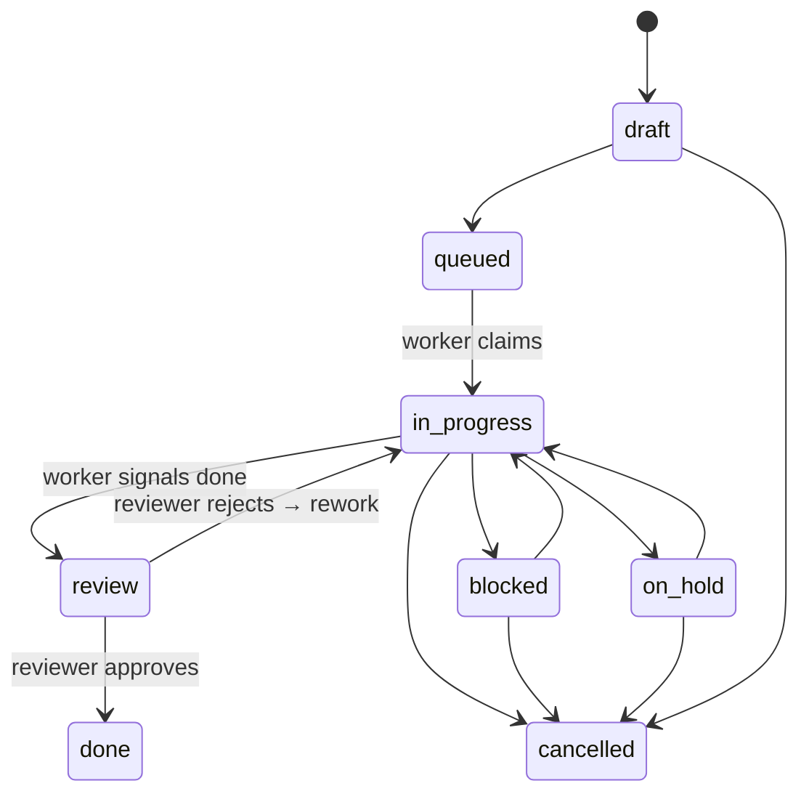

# PollyPM

PollyPM is a tmux-first control plane for people who want multiple AI coding sessions working in parallel without losing visibility or control. It is built for operators managing Claude Code and Codex CLI across real projects, with a live cockpit, heartbeat supervision, and issue-driven worker coordination. At a high level, PollyPM launches and monitors dedicated operator and worker sessions, routes work through a shared task pipeline, and keeps state recoverable through logs, checkpoints, and project-aware context. The result is managed multi-session AI coordination through native terminal sessions rather than opaque background agents.

## Architecture

```mermaid
graph TB
    subgraph User["User Layer"]
        CLI["pm CLI<br/><i>typer</i>"]
        Cockpit["Cockpit TUI<br/><i>textual</i>"]
    end

    subgraph Core["Core — Required"]
        Supervisor["Supervisor<br/>Session lifecycle · health ·<br/>recovery · failover"]
        WorkService["Work Service<br/>Task state machine ·<br/>flow engine · gates"]
        StateStore["StateStore<br/>SQLite + WAL"]
        Inbox["Inbox v2<br/>Threaded messages"]
        Config["Config<br/>TOML resolution"]
        TmuxClient["Tmux Client<br/>Session · window · pane mgmt"]
    end

    subgraph PluginHost["Plugin Host"]
        API["Plugin API v1<br/><i>PollyPMPlugin protocol</i>"]
    end

    subgraph Providers["Provider Plugins — replaceable"]
        Claude["☑ claude<br/>Claude Code adapter"]
        Codex["codex<br/>Codex CLI adapter"]
    end

    subgraph Runtimes["Runtime Plugins — replaceable"]
        LocalRT["☑ local_runtime<br/>Direct shell exec"]
        DockerRT["docker_runtime<br/>Docker container"]
    end

    subgraph Heartbeats["Heartbeat Plugins — replaceable"]
        LocalHB["☑ local_heartbeat<br/>tmux pane monitoring"]
    end

    subgraph Schedulers["Scheduler Plugins — replaceable"]
        InlineSched["☑ inline_scheduler<br/>In-process polling"]
    end

    subgraph Profiles["Agent Profile Plugins — replaceable"]
        CoreProfiles["☑ core_agent_profiles<br/>polly · russell · heartbeat ·<br/>worker · triage"]
        ItsAlive["itsalive<br/>Deploy-aware prompts<br/>+ session hooks"]
        Magic["magic<br/>Compatibility alias"]
    end

    subgraph Backends["Storage Backends — replaceable"]
        FileTask["file task backend<br/>Markdown issues"]
        GitHubTask["github task backend<br/>GitHub Issues sync"]
        FileMemory["file memory backend<br/>Append-only entries"]
    end

    CLI --> Supervisor
    CLI --> WorkService
    Cockpit --> Supervisor
    Cockpit --> WorkService

    Supervisor --> TmuxClient
    Supervisor --> StateStore
    Supervisor --> Inbox
    Supervisor --> Config

    WorkService --> StateStore

    Supervisor --> API
    API --> Claude
    API --> Codex
    API --> LocalRT
    API --> DockerRT
    API --> LocalHB
    API --> InlineSched
    API --> CoreProfiles
    API --> ItsAlive
    API --> Magic

    WorkService --> FileTask
    WorkService --> GitHubTask
    WorkService --> FileMemory
```



> ☑ = default plugin, loaded unless overridden in config.

## Plugin System

Every major subsystem is behind a `Protocol` interface and replaceable via the plugin API. Plugins register with the `PollyPMPlugin` dataclass, declaring capabilities and factory functions.

### Core Modules (required — the system does not start without these)

| Module | Role |
|--------|------|
| **Supervisor** | Session lifecycle, health classification, recovery escalation, account failover |
| **Work Service** | Task state machine with directed-graph flow engine, hard/soft gates, cross-project dependencies |
| **StateStore** | SQLite (WAL mode) for all runtime state — sessions, events, heartbeats, alerts, leases, token usage |
| **Inbox v2** | Threaded async messaging between operator, workers, and user |
| **Tmux Client** | All session/window/pane management — the shared cockpit surface |
| **Config** | TOML-based config resolution (global `~/.pollypm/pollypm.toml` + project-scoped overrides) |
| **Plugin Host** | Discovery, validation, and registration of all plugins |

### Replaceable Plugins

| Plugin | Capability | Default | What it does |
|--------|-----------|---------|-------------|
| `claude` | provider | **yes** | Adapter for Claude Code CLI sessions |
| `codex` | provider | no | Adapter for Codex CLI sessions |
| `local_runtime` | runtime | **yes** | Executes agent commands directly in the local shell |
| `docker_runtime` | runtime | no | Wraps agent commands in `docker run` with volume mounts |
| `local_heartbeat` | heartbeat | **yes** | Monitors health via tmux pane capture + transcript delta analysis |
| `inline_scheduler` | scheduler | **yes** | In-process job scheduler for recurring heartbeat sweeps |
| `core_agent_profiles` | agent_profile | **yes** | Persona prompts: Polly (PM), Russell (reviewer), heartbeat, worker, triage |
| `itsalive` | agent_profile, hook | no | itsalive.co deployment integration — deploy-aware prompts + post-launch hooks |
| `magic` | agent_profile | no | Compatibility alias for itsalive deploy instructions |

### Storage Backends (also replaceable)

| Backend | Interface | What it does |
|---------|-----------|-------------|
| File task backend | `TaskBackend` | Markdown files in `issues/` with 6-state folder structure |
| GitHub task backend | `TaskBackend` | GitHub Issues as backend with label-based state mapping |
| File memory backend | `MemoryBackend` | Append-only entries under `.pollypm-state/memory/` |

### Writing a Plugin

Plugins are Python packages with a `plugin.py` that exports a `PollyPMPlugin` instance:

```python
from pollypm.plugin_api.v1 import PollyPMPlugin
from my_provider import MyAdapter

plugin = PollyPMPlugin(
    name="my_provider",
    capabilities=("provider",),
    providers={"my_provider": MyAdapter},
)
```

The plugin host discovers shipped plugins from `plugins_builtin/` and external plugins via `.pollypm-plugin.toml` manifests.

## Session Roles



## Task Lifecycle



## Quick Start

```bash
# Install
pip install -e .

# Initialize a project
pm init

# Add a Claude account
pm add-account claude

# Launch all sessions (heartbeat, operator, reviewer, workers)
pm up

# Open the cockpit TUI
pm ui

# Send work to Polly
pm send operator "Build a weather CLI with current conditions and 5-day forecast"

# Check system status
pm status
```

## Commit Message Hook

Install the Conventional Commits `commit-msg` hook with:

```bash
python3 scripts/install_commit_msg_hook.py
```

Git will then run `scripts/commit-msg` on each commit and reject messages that do not match `type(scope): description`.
