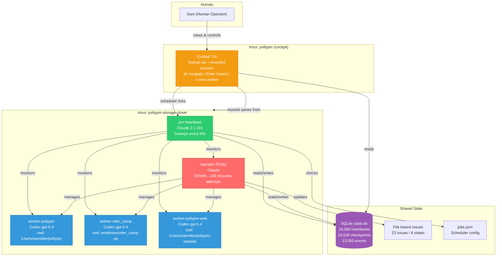

# Architecture Overview

PollyPM tmux session layout showing the cockpit, storage closet, and all managed sessions.

```mermaid
graph TB
    subgraph Human
        Sam["Sam (Human Operator)"]
    end

    subgraph pollypm_session["tmux: pollypm (cockpit)"]
        Cockpit["Cockpit TUI<br/>Textual rail + mounted session<br/>j/k navigate | Enter mount | n new worker"]
    end

    subgraph storage["tmux: pollypm-storage-closet"]
        HB["pm-heartbeat<br/>Claude 2.1.101<br/>Sweeps every 60s"]
        OP["operator (Polly)<br/>Claude<br/>DOWN - 139 recovery attempts"]
        W1["worker-pollypm<br/>Codex gpt-5.4<br/>cwd: /Users/sam/dev/pollypm"]
        W2["worker-otter_camp<br/>Codex gpt-5.4<br/>cwd: worktrees/otter_camp-pa"]
        W3["worker-pollypm-web<br/>Codex gpt-5.4<br/>cwd: /Users/sam/dev/pollypm-website"]
    end

    subgraph data["Shared State"]
        DB[("SQLite state.db<br/>16,569 heartbeats<br/>16,528 checkpoints<br/>13,063 events")]
        Issues["File-based Issues<br/>23 issues / 6 states"]
        Jobs["jobs.json<br/>Scheduler config"]
    end

    Sam -->|"views & controls"| Cockpit
    Cockpit -->|"mounts panes from"| storage
    Cockpit -->|"scheduler ticks"| HB
    HB -->|"monitors"| OP
    HB -->|"monitors"| W1
    HB -->|"monitors"| W2
    HB -->|"monitors"| W3
    OP -->|"manages"| W1
    OP -->|"manages"| W2
    OP -->|"manages"| W3
    HB -->|"reads/writes"| DB
    OP -->|"reads/writes"| DB
    Cockpit -->|"reads"| DB
    HB -->|"checks"| Jobs
    OP -->|"updates"| Issues

    style OP fill:#ff6b6b,stroke:#c0392b,color:#fff
    style HB fill:#2ecc71,stroke:#27ae60,color:#fff
    style W1 fill:#3498db,stroke:#2980b9,color:#fff
    style W2 fill:#3498db,stroke:#2980b9,color:#fff
    style W3 fill:#3498db,stroke:#2980b9,color:#fff
    style Cockpit fill:#f39c12,stroke:#e67e22,color:#fff
    style DB fill:#9b59b6,stroke:#8e44ad,color:#fff
```
