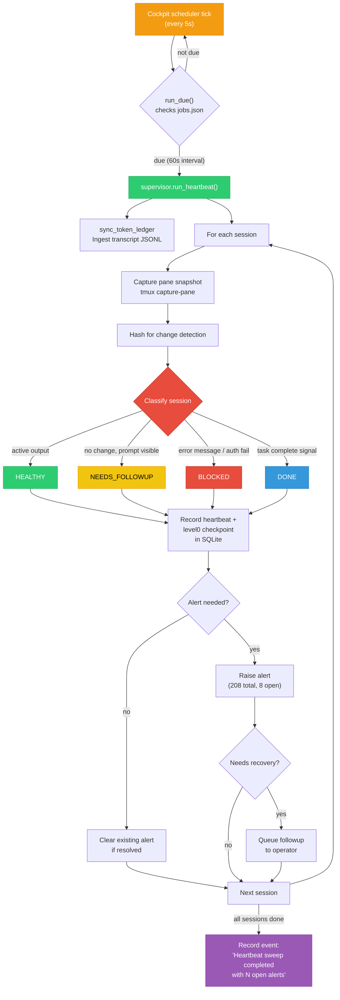

# Heartbeat Sweep Flow

How the heartbeat monitors all sessions every 60 seconds.

## Key Numbers

| Metric | Value |
|--------|-------|
| Heartbeat records | 16,569 |
| Level 0 checkpoints | 16,528 |
| Lifecycle events | 13,063 |
| Total alerts raised | 208 |
| Currently open alerts | 8 |
| Token samples | 227 |
| Hourly aggregations | 72 |
