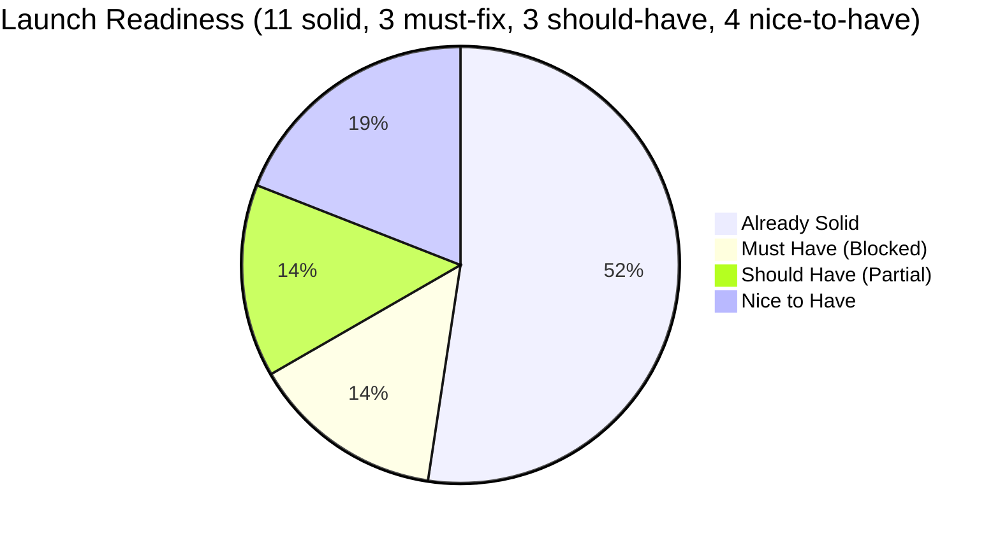
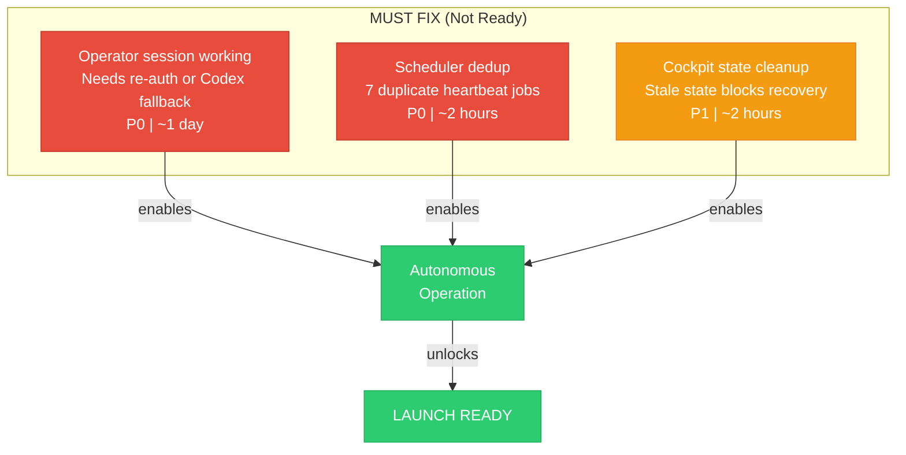
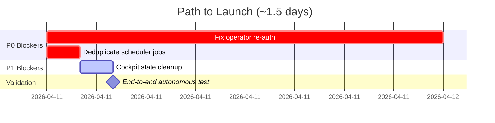

# Launch Readiness

What is ready, what is blocked, and what is the path to launch.

## Must Have -- Blockers

## Already Solid (11 components)

```mermaid
flowchart LR
    subgraph solid["READY"]
        S1["Core tmux<br/>management"]
        S2["Heartbeat<br/>monitoring"]
        S3["Recovery<br/>pipeline"]
        S4["Knowledge<br/>extraction"]
        S5["Token/cost<br/>tracking"]
        S6["File-based<br/>issue tracker"]
        S7["Account<br/>isolation"]
        S8["402-test<br/>suite"]
        S9["Cockpit TUI<br/>navigation"]
        S10["Onboarding<br/>flow"]
        S11["5 managed<br/>projects"]
    end

    style S1 fill:#2ecc71,stroke:#27ae60,color:#fff
    style S2 fill:#2ecc71,stroke:#27ae60,color:#fff
    style S3 fill:#2ecc71,stroke:#27ae60,color:#fff
    style S4 fill:#2ecc71,stroke:#27ae60,color:#fff
    style S5 fill:#2ecc71,stroke:#27ae60,color:#fff
    style S6 fill:#2ecc71,stroke:#27ae60,color:#fff
    style S7 fill:#2ecc71,stroke:#27ae60,color:#fff
    style S8 fill:#2ecc71,stroke:#27ae60,color:#fff
    style S9 fill:#2ecc71,stroke:#27ae60,color:#fff
    style S10 fill:#2ecc71,stroke:#27ae60,color:#fff
    style S11 fill:#2ecc71,stroke:#27ae60,color:#fff
```

## Estimated Path to Launch

## Verdict

**Not launch-ready yet.** The operator crash loop (139 failed recoveries) and the remaining operational gaps mean the system cannot run autonomously. A human must still babysit sessions. Fixing the remaining top blockers unblocks autonomous multi-project operation.
