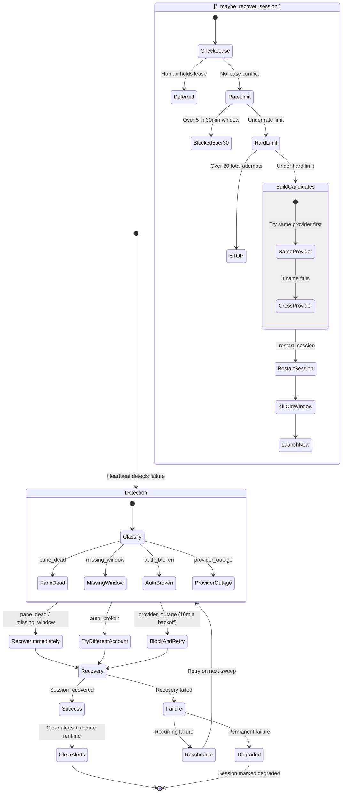
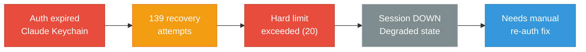

# Recovery Pipeline

Escalation from failure detection through recovery to degraded state.

## Operator Recovery: Case Study

The operator session (Polly) demonstrates the pipeline at its limits:

## Rate Limits

| Guard | Threshold | Effect |
|-------|-----------|--------|
| Lease check | Human holds lease | Defer recovery |
| Rate limit | 5 per 30min window | Queue for later |
| Hard limit | 20 total attempts | STOP permanently |
