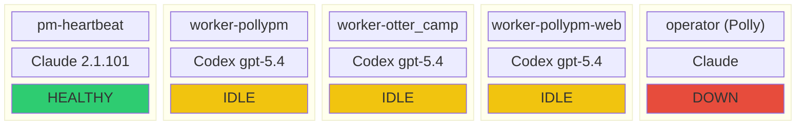
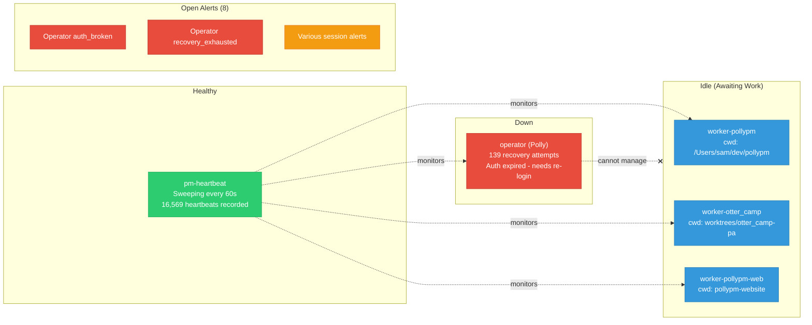

# Session Health Dashboard

Current state of all 5 managed sessions as of April 11, 2026.

## Detailed Status

## Scheduler Status

```mermaid
gantt
    title Active Scheduler Jobs
    dateFormat X
    axisFormat %s

    section Heartbeat
    heartbeat-1  :active, 0, 60
    heartbeat-2  :active, 60, 120
    heartbeat-3  :active, 120, 180
    heartbeat-4  :active, 180, 240
    heartbeat-5  :active, 240, 300
    heartbeat-6  :active, 300, 360
    heartbeat-7  :active, 360, 420

    section Knowledge
    extract-1    :active, 0, 900
    extract-2    :active, 900, 1800
    extract-3    :active, 1800, 2700
```

Note: 7 duplicate heartbeat jobs exist due to missing dedup on cockpit restart. Should be 1.
