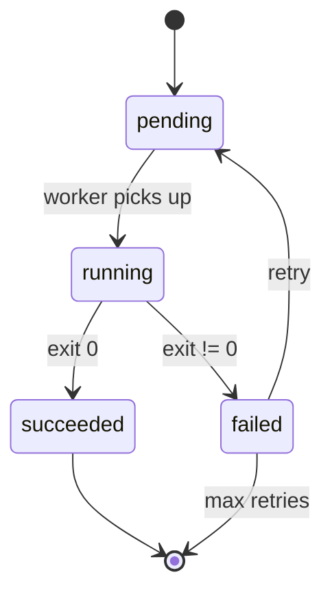

# Mermaid Diagram

## When to use

Mermaid is the default when the diagram will live inside a markdown file — GitHub, GitLab, Obsidian, and most wikis render it natively. Choose Mermaid over Excalidraw or SVG whenever the user will commit the result to a repo and wants future edits to stay in-repo as text.

## Process

1. Pick the diagram type up front. Flowchart (`graph TD`), sequence (`sequenceDiagram`), state (`stateDiagram-v2`), ER (`erDiagram`), class (`classDiagram`), gantt (`gantt`). Do not mix types in one fence.
2. Name every node with a stable short ID plus a human label: `api[Polly API]`. IDs let the user reference nodes in conversation; labels make the diagram readable.
3. Keep graphs narrow-and-tall or wide-and-flat — never a tangled mat. Flowcharts: `graph TD` for <=10 nodes, `graph LR` beyond that.
4. Group related nodes with `subgraph`. Label subgraphs with the layer name.
5. Use link styles sparingly: solid arrows (`-->`) for default, dotted (`-.->`) for async, thick (`==>`) for critical path. Legends are rare in Mermaid; reserve styling for meaningful distinctions.
6. Render locally via `mmdc` (mermaid CLI) to verify the syntax parses. If it fails, read the error — Mermaid errors are usually one line off.
7. Emit inside a triple-backtick mermaid fence so it renders in-place.

## Example invocation

```
User: "Show the job lifecycle as a state diagram."

Agent response:

```

## Outputs

- A mermaid code block embedded directly in the markdown response.
- Syntactically valid (parsed via `mmdc` before emitting).
- Nodes have short stable IDs + human labels.
- Subgraphs used when there are layers.

## Common failure modes

- Using Mermaid when the user wanted a hand-drawn feel — pick Excalidraw instead.
- Mixing `graph TD` with `sequenceDiagram` syntax in one fence.
- Omitting node IDs so users cannot reference "box 3" in follow-ups.
- Skipping the local parse step; silent syntax errors render as a red error box in GitHub.
